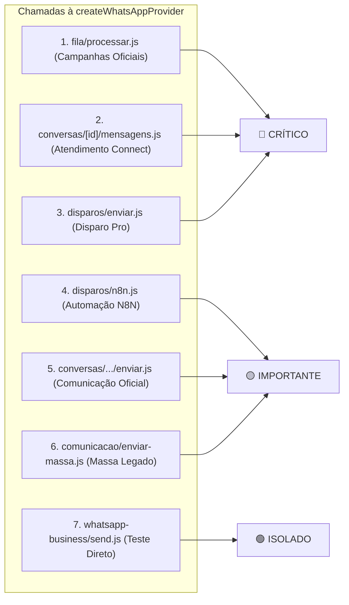

# AUDITORIA FORENSE DE IMPACTO ARQUITETURAL — MÓDULO WHATSAPP
**MandatoPRO — Análise de Evidências em Código e Banco de Dados (Modo Somente-Leitura)**

---

## 1. Inventário de Referências a Providers

Abaixo está o mapeamento exato de todas as ocorrências de `'META'`, `'YCLOUD'` e `'WABLAST'` no código-fonte e esquemas do sistema, avaliando o impacto caso um 4º provedor (ex: `WAFLY`) seja introduzido sem a atualização pontual daquele trecho:

| Arquivo | Linha / Função | Código / Regra | Impacto se WAFLY for adicionada | Risco |
| :--- | :--- | :--- | :--- | :---: |
| `supabase/migrations/253_add_wablast_provider_support.sql` | L31 (DDL) | `CHECK (provider IN ('META', 'WABLAST', 'YCLOUD'))` | **Bloqueio total no banco:** Qualquer tentativa de gravar ou cadastrar conta com `provider = 'WAFLY'` será rejeitada com erro de violação de constraint no PostgreSQL. | 🔴 ALTO |
| `src/services/whatsapp-provider-factory.js` | L241-254 (`createWhatsAppProvider`) | `if (provider === 'WABLAST') ... if (provider === 'YCLOUD') ... return new MetaWhatsAppAdapter(account)` | **Fallback silencioso desastroso:** A conta WAFLY cairá no `MetaWhatsAppAdapter`. Disparos tentarão usar a Meta Graph API, gerando erro de token ou disparando pelo chip Meta padrão do servidor. | 🔴 ALTO |
| `src/lib/whatsapp-business-accounts.js` | L198 (`alterarProvedorWhatsappAtivo`) | `if (!['META', 'YCLOUD', 'WABLAST'].includes(targetProvider))` | **Rejeição em API:** O painel administrativo não conseguirá ativar o provedor WAFLY como principal do gabinete (HTTP 400). | 🔴 ALTO |
| `src/lib/whatsapp-business-accounts.js` | L227-260 (`alterarProvedorWhatsappAtivo`) | `if (targetProvider === 'YCLOUD') ... else if (targetProvider === 'META') ... else if (targetProvider === 'WABLAST')` | Validações de completude antes de salvar (API Key, WABLAST ID, token). Sem bloco para WAFLY, a conta é ativada sem validação de suas credenciais. | 🟡 MÉDIO |
| `src/lib/whatsapp-business-accounts.js` | L988-1002 (`resolverContaWhatsappDaConversa`) | `if (!provSugerido && meta.origem === 'ycloud') ... 'wablast' ... 'whatsapp_meta'` | **Perda de canal na resposta:** Se uma conversa vier do WAFLY e não houver número `to` no inbound, o resolver não reconhece `meta.origem === 'wafly'` e cai no fallback da conta principal (que pode ser Meta ou YCloud). | 🔴 ALTO |
| `src/pages/api/whatsapp-business/config.js` | L53-58 (`handler` GET) | `isMetaConnected = ...; isYCloudConnected = ...; isWablastConnected = ...;` | A UI não reportará status de conexão do WAFLY (campo `availableProviders` retornará sem a chave WAFLY). | 🟡 MÉDIO |
| `src/pages/api/whatsapp-business/config.js` | L97 (`handler` POST) | `if (!['META', 'YCLOUD', 'WABLAST'].includes(targetProvider))` | Bloqueia a troca via API para o provedor WAFLY com HTTP 400. | 🔴 ALTO |
| `src/pages/api/whatsapp-business/templates.js` | L29-150 (`handler` GET) | `if (provider === 'WABLAST') ... else if (provider === 'YCLOUD') ... else if (provider === 'META')` | O seletor de templates na criação de campanhas retornará array vazio (`templates: []`) para contas WAFLY. | 🟡 MÉDIO |
| `src/services/whatsapp-business-health.js` | L39-188 (`gerarDiagnosticoWhatsappBusiness`) | `if (provider === 'WABLAST') ... else if (provider === 'YCLOUD') ... fallback META` | O diagnóstico de saúde da conta WAFLY tentará validar Debug Token na Graph API da Meta, acusando erro constante no painel. | 🟡 MÉDIO |
| `src/services/whatsapp-business-sync.js` | L70-84 (`sincronizarContaWhatsappBusiness`) | `if (provider === 'WABLAST') ... else if (provider === 'YCLOUD') ... fallback META` | Sincronização periódica da conta WAFLY tentará chamar Meta Graph API. | 🟡 MÉDIO |
| `src/services/atendimentoRelatoriosService.js` | L234-246 (`relatorios`) | Heurística por ID: `pmid.startsWith('wamid.')` $\rightarrow$ META, `pmid.length === 24` $\rightarrow$ YCLOUD, `startsWith('cmt')` $\rightarrow$ WABLAST | Relatórios gerenciais classificarão mensagens do WAFLY como 'META' por fallback (L483: `|| 'META'`). | 🟡 MÉDIO |
| `src/lib/repositories-dashboard-campaign.js` | L40-46 e L106 | `provedoresLista = ['WABLAST', 'YCLOUD', 'META', ...]` | Métricas de dashboard não agregarão dados específicos de WAFLY se o filtro for aplicado. | 🟢 BAIXO |
| `src/pages/api/comunicacao-oficial/campanhas/[id]/detalhes.js` | L87-92 | `if (providerRaw === 'WABLAST') ... else if (providerRaw === 'YCLOUD') ... else if (providerRaw === 'META')` | O nome formatado do provedor na tela de detalhes da campanha exibirá 'Canal Oficial' em vez do nome do novo provedor. | 🟢 BAIXO |
| `src/pages/comunicacao-oficial/whatsapp-business.js` | L234-330 (UI Frontend) | Cards estáticos de seleção de provedores (Meta, YCloud, WaBlast) | O usuário não terá botão visual para selecionar WAFLY na tela de configurações oficiais. | 🟡 MÉDIO |

---

## 2. Auditoria do Fallback da Factory

### 2.1 Código Real Auditado
No arquivo `src/services/whatsapp-provider-factory.js` (Linhas 241 a 255):

```javascript
export function createWhatsAppProvider(account = {}) {
  const provider = String(account.provider || account.provider_type || 'META').toUpperCase();

  if (provider === 'WABLAST') {
    return new WaBlastWhatsAppAdapter(account);
  }

  if (provider === 'YCLOUD') {
    return new YCloudWhatsAppAdapter(account);
  }

  // Padrão: META
  return new MetaWhatsAppAdapter(account);
}
```

### 2.2 Evidências Forenses do Comportamento:
1. **Como o provider é resolvido:**
   Avalia `account.provider`, depois `account.provider_type`, e se ambos forem falsy, adota `'META'`. Aplica `.toUpperCase()`.
2. **O que acontece com um provider desconhecido (ex: `'WAFLY'`, `'TWILIO'`):**
   `provider === 'WABLAST'` resulta `false`.  
   `provider === 'YCLOUD'` resulta `false`.  
   A execução alcança a linha 253: **retorna silenciosamente uma instância de `MetaWhatsAppAdapter(account)`**.
3. **O que acontece se `provider` for `null` ou `undefined`:**
   Cai na string `'META'` e instancia `MetaWhatsAppAdapter(account)`.
4. **O que acontece se houver erro de digitação (ex: `'wafly'`, `'Wafly'`, `'Y_CLOUD'`):**
   Cai silenciosamente em `MetaWhatsAppAdapter(account)`.
5. **Comportamento Crítico com WAFLY:**
   Se uma conta for salva no banco como `provider = 'WAFLY'` e a factory **não** for atualizada:
   * A factory instanciará `MetaWhatsAppAdapter(account)`.
   * O construtor do `MetaWhatsAppAdapter` tentará ler `account.phoneNumberId` e `account.accessToken`. Como a conta WAFLY terá credenciais próprias (e não da Meta), essas propriedades serão nulas.
   * Ao tentar enviar mensagem (`sendMessage` ou `sendTemplate`), o método chamará `WhatsAppBusinessService.sendTextMessage()`.
   * **Falha Imediata:** O serviço lançará a exceção:  
     `"WhatsApp Business API não configurado. Configure Phone Number ID e Access Token."`
   * **Risco de Fuga de Dados:** Se o servidor possuir as variáveis globais `WHATSAPP_PHONE_NUMBER_ID` e `WHATSAPP_ACCESS_TOKEN` configuradas no ambiente `.env`, a mensagem **sairá indevidamente pelo chip da Meta** do servidor em vez do chip da conta do cliente!

---

## 3. Todas as Chamadas à Provider Factory

Localizamos **7 pontos de chamada** à `createWhatsAppProvider()` em fluxos de produção:



### Detalhamento Forense das Chamadas:

#### 1. Fila de Campanhas da Comunicação Oficial
* **Arquivo:** `src/pages/api/comunicacao-oficial/fila/processar.js` (Linha 149)
* **Função:** `carregarContextoCampanha(campId)`
* **Origem do `account`:** `buscarContaWhatsappPrincipal(supabase, { tenant_id: campanha.tenant_id })`
* **Como o provider é definido:** `contaSelecionada.provider`
* **Fluxo afetado:** Disparos massivos de templates HSM oficiais de gabinetes.
* **Criticidade:** 🔴 **CRÍTICO**

#### 2. Atendimento Connect (Chat com Eleitor)
* **Arquivo:** `src/pages/api/atendimento-connect/conversas/[id]/mensagens.js` (Linha 131)
* **Função:** `handler` (Método POST, envio de saída)
* **Origem do `account`:** `resolverContaWhatsappDaConversa(supabase, conversa, usuario)`
* **Como o provider é definido:** Resolução contextual baseada no histórico de entrada do eleitor.
* **Fluxo afetado:** Resposta manual dos operadores do gabinete aos cidadãos.
* **Criticidade:** 🔴 **CRÍTICO**

#### 3. Gateway de Disparos Rápidos (Disparo Pro)
* **Arquivo:** `src/pages/api/disparos/enviar.js` (Linha 49)
* **Função:** `handler` (Método POST)
* **Origem do `account`:** `buscarContaWhatsappPrincipal(supabase, usuario)`
* **Como o provider é definido:** `conta.provider`
* **Fluxo afetado:** Campanhas de aniversário, benefícios e disparos pontuais via Disparo Pro.
* **Criticidade:** 🔴 **CRÍTICO**

#### 4. Webhook de Automação Externa (N8N)
* **Arquivo:** `src/pages/api/disparos/n8n.js` (Linha 45)
* **Função:** `handler` (POST)
* **Origem do `account`:** `buscarContaWhatsappPrincipal(supabase, usuario)`
* **Como o provider é definido:** `conta.provider`
* **Fluxo afetado:** Disparos acionados via webhooks de fluxos do N8N.
* **Criticidade:** 🟡 **IMPORTANTE**

#### 5. Chat da Comunicação Oficial
* **Arquivo:** `src/pages/api/comunicacao-oficial/conversas/[id]/mensagens/enviar.js` (Linha 50)
* **Função:** `handler` (POST)
* **Origem do `account`:** `buscarContaWhatsappPrincipal(supabase, { tenant_id: conversa.tenant_id })`
* **Como o provider é definido:** `contaSelecionada.provider`
* **Fluxo afetado:** Envio direto de mensagens na interface de conversas da Comunicação Oficial.
* **Criticidade:** 🟡 **IMPORTANTE**

#### 6. Envio em Massa Interno
* **Arquivo:** `src/pages/api/comunicacao/enviar-massa.js` (Linha 26)
* **Função:** `carregarConfiguracao(supabase, usuario)`
* **Origem do `account`:** `buscarContaWhatsappPrincipal(supabase, usuario)`
* **Como o provider é definido:** `conta.provider`
* **Fluxo afetado:** Mensagens em massa para operadores e lideranças internas cadastradas.
* **Criticidade:** 🟡 **IMPORTANTE**

#### 7. Endpoint de Teste Operacional Direto
* **Arquivo:** `src/pages/api/whatsapp-business/send.js` (Linha 45)
* **Função:** `handler` (POST)
* **Origem do `account`:** `buscarContaWhatsappPrincipal(supabase, usuario)`
* **Como o provider é definido:** `conta.provider`
* **Fluxo afetado:** Teste manual executado por administradores no painel.
* **Criticidade:** 🟢 **ISOLADO**

---

## 4. Auditoria de resolverContaWhatsappDaConversa

A função `resolverContaWhatsappDaConversa` em `src/lib/whatsapp-business-accounts.js` (Linhas 838 a 1027) é o componente mais sensível do chat de atendimento.

### 4.1 Evidência Passo a Passo da Lógica Real:
1. **Tabelas Consultadas:**
   * Consulta inicial em `whatsapp_business_accounts` com join em `whatsapp_business_numbers` filtrando `tenant_id` e `status = 'ATIVO'`.
   * Consulta em `atendimento_connect_mensagens` buscando a última mensagem com `direcao = 'entrada'` daquela `conversa_id`.
2. **Preservação do Número e Provider Original (Hierarquia de Decisão):**
   * **Nível 1 (Número receptor `to`):** Lê `inboundMsg.to || payload.to || payload.recipient`. Varre todas as contas ativas do tenant procurando qual conta possui aquele número em `whatsapp_business_numbers.display_phone_number` ou `phone_number_id`. Se achar, retorna essa conta (`motivo: 'ultima_entrada_numero_to'`).
   * **Nível 2 (WABA ID do inbound):** Lê `inboundMsg.wabaId || payload.waba_id`. Compara com `waba_id` ou `wablast_waba_id`. Se achar, retorna essa conta (`motivo: 'ultima_entrada_waba_id'`).
   * **Nível 3 (Provider explícito no payload):**  
     `const provEntrada = payload.provider || (payload.type?.startsWith('whatsapp.') ? 'YCLOUD' : null);`  
     Compara com `conta.provider`.
   * **Nível 4 (Metadata da Conversa):**  
     Lê `conversa.metadata.numero_gabinete`, `metadata.wabaId` e:
     ```javascript
     // Linhas 989-993:
     let provSugerido = meta.provider || null;
     if (!provSugerido && meta.origem === 'ycloud') provSugerido = 'YCLOUD';
     if (!provSugerido && meta.origem === 'wablast') provSugerido = 'WABLAST';
     if (!provSugerido && meta.origem === 'whatsapp_meta') provSugerido = 'META';
     ```
   * **Nível 5 (Fallback Final):**  
     Se nenhum critério acima coincidir, executa a Linha 1006:
     ```javascript
     contaResolvida = await buscarContaWhatsappPrincipal(supabase, usuario);
     motivoResolucao = 'fallback_conta_principal';
     ```

### 4.2 O que Acontece com um Provedor Futuro (WAFLY)?
* Se o payload de webhook do WAFLY gravar no `metadata` o valor `origem: 'wafly'`, **as linhas 989-993 não possuem verificação para `'wafly'`**.
* Se o telefone receptor `to` também não estiver presente no payload bruto gravado na mensagem, **a conversa cairá no Nível 5 (conta principal)**.
* Se a conta principal do gabinete for META, a resposta do operador sairá pela Meta Graph API para um eleitor que enviou mensagem pelo chip do WAFLY, resultando em:
  * Erro `131047` (Janela de 24 horas não existente na Meta para aquele eleitor).
  * Mensagem entregue a partir de um número de WhatsApp diferente daquele em que o eleitor iniciou a conversa.

---

## 5. Formato Canônico Real dos Webhooks

### 5.1 Matriz Comparativa do Payload Interno:

| Campo Canônico | META (`meta-webhook.js`) | WABLAST (`wablast-webhook.js`) | YCLOUD (`ycloud-webhook.js`) |
| :--- | :--- | :--- | :--- |
| **`provider_message_id`** | `rawMessage.id` (ex: `wamid.HBg...`) | `data.id` / `msgObj.wamid` | `inbound.wamid` / `payload.id` |
| **`event_id`** | Não extrai no webhook (idempotência por `provider_message_id`) | Header `webhook-id` ou `provider_message_id` | `payload.id` (gravado em `whatsapp_business_webhook_events`) |
| **`direção`** | Definido como `'entrada'` na persistência | Definido como `'entrada'` na persistência | Definido como `'entrada'` na persistência |
| **`tipo`** | `'mensagem'` ou `'status'` | `'mensagem'`, `'status'`, `'account.connected'` | Inferido via `payload.type` (`whatsapp.inbound_message.received` ou `whatsapp.message.updated`) |
| **`remetente` (contato)** | `rawMessage.from` | `cleanSender` (apenas dígitos) | `inbound.from` (normalizado com `normalizarTelefone`) |
| **`destinatário` (gabinete)** | `value.metadata.display_phone_number` | `data.to` ou `phone_number` | `inbound.to` |
| **`texto`** | `rawMessage.text?.body` | `msgObj.text?.body` / `msgObj.content` | `inbound.text?.body` |
| **`mídia`** | `rawMessage[type]?.id` $\rightarrow$ `media_id` | `msgObj.media_id` $\rightarrow$ `media_id` | Não salva `media_id` isolado; grava em `[Mensagem Mídia/Outro]` |
| **`quotedMessageId`** | `rawMessage.context?.id` | Não extrai explicitamente | `inbound.context?.id` / `inbound.quotedMessageId` |
| **`status`** | `'sent'`, `'delivered'`, `'read'`, `'failed'` | `'sent'`, `'delivered'`, `'read'`, `'failed'` | `'sent'`, `'delivered'`, `'read'`, `'failed'` |
| **`timestamp`** | `new Date(Number(ts)*1000).toISOString()` | `payload.timestamp || new Date().toISOString()` | `payload.createTime || new Date().toISOString()` |
| **`tenant_id`** | Resolvido via WABA ou Phone Number ID | Resolvido via `external_ref` (`tenant_{id}`) | Resolvido via `x-webhook-endpoint-id` da conta |
| **`account_id`** | ID da conta `whatsapp_business_accounts` | `data.account_id` (WaBlast ID) e ID do banco | ID da conta `whatsapp_business_accounts` |
| **`phone_number_id`** | `value.metadata.phone_number_id` | `data.phone_number_id` | `conta.whatsapp_business_numbers[0].phone_number_id` |
| **`provider`** | Gravado como `'META'` ou `'whatsapp'` | Gravado como `'WABLAST'` ou `'whatsapp'` | Gravado como `'YCLOUD'` |

### 5.2 Determinação Arquitetural Crítica:
* **META e WABLAST compartilham o mesmo pipeline canônico:**  
  Ambos utilizam normalizadores que transformam seus eventos para a estrutura `{ tipo: 'mensagem' | 'status', provider_message_id, contact_id, ... }` e despacham para a mesma função central: `ConversasService.processarEventoMeta(evento)` $\rightarrow$ `src/services/processarEventoComunicacao.js`.
* **YCLOUD opera em pipeline paralelo:**  
  O webhook da YCloud **não** utiliza normalizador externo nem chama `ConversasService.processarEventoMeta`. Toda a lógica de verificação de eleitor, cálculo de prioridade de status e inserção nas tabelas foi implementada diretamente dentro de `src/pages/api/whatsapp-business/ycloud-webhook.js`. Além disso, a YCloud alimenta apenas `atendimento_connect_*`, sem gravar em `communication_conversations` ou `communication_messages`.

---

## 6. Pipeline Inbound Crítico

Mapeamento da árvore de execução real do recebimento até o banco:

```
[META WEBHOOK]
src/pages/api/whatsapp-business/meta-webhook.js (handler POST)
  ├── 1. readRawBody(req)
  ├── 2. validarAssinatura(rawBody, header['x-hub-signature-256'], appSecret)
  ├── 3. logger.log(...) -> whatsapp_business_webhook_events
  ├── 4. MetaWebhookNormalizer.normalizarMensagem(value)
  └── 5. ConversasService.processarEventoMeta(msgNormalizada)
           └── src/services/processarEventoComunicacao.js
                 ├── 5.1. processarEventoMensagem() [Idempotência por wamid]
                 ├── 5.2. buscarContaWhatsappPorWabaOuNumero() [Tenant]
                 ├── 5.3. resolverCampanhaInbound() [Atribuição de Campanha]
                 ├── 5.4. Supabase INSERT -> communication_conversations / communication_messages
                 └── 5.5. Supabase INSERT -> atendimento_connect_conversas / atendimento_connect_mensagens

[WABLAST WEBHOOK]
src/pages/api/whatsapp-business/wablast-webhook.js (handler POST)
  ├── 1. readRawBody(req)
  ├── 2. validarAssinaturaWaBlast(rawBody, headers, WABLAST_WEBHOOK_SECRET)
  ├── 3. logger.log(...) -> whatsapp_business_webhook_events
  ├── 4. WaBlastWebhookNormalizer.normalizarEvento(rawPayload)
  └── 5. ConversasService.processarEventoMeta(evento)
           └── src/services/processarEventoComunicacao.js  <── [PRIMEIRO PONTO COMUM COM META]
                 ├── 5.1. processarEventoMensagem() ou processarEventoStatus()
                 ├── 5.2. Supabase INSERT -> communication_conversations / communication_messages
                 └── 5.3. Supabase INSERT -> atendimento_connect_conversas / atendimento_connect_mensagens

[YCLOUD WEBHOOK] (PIPELINE PARALELO)
src/pages/api/whatsapp-business/ycloud-webhook.js (handler POST)
  ├── 1. buscarContaWhatsappPorYCloudEndpointId(header['x-webhook-endpoint-id'])
  ├── 2. readRawBody(req)
  ├── 3. validarAssinaturaYCloud(rawBody, header['ycloud-signature'], secret)
  ├── 4. logger.log(...) -> whatsapp_business_webhook_events
  ├── 5. Idempotência por event_id em whatsapp_business_webhook_events
  ├── 6. resolverCampanhaInbound() [Atribuição de Campanha]
  └── 7. Supabase INSERT direto -> atendimento_connect_conversas / atendimento_connect_mensagens
```

### O Primeiro Ponto Comum:
* O primeiro ponto comum de código reutilizável entre provedores é a função `ConversasService.processarEventoMeta` (que na verdade é agnóstica e invoca `processarEventoComunicacao.js`).
* **Conclusão Arquitetural para Extensão:**  
  Um futuro `WaflyWebhookNormalizer` poderá ser plugado em um endpoint próprio (`/api/whatsapp-business/wafly-webhook.js`), validando sua própria assinatura criptográfica, e repassando o objeto normalizado diretamente para `ConversasService.processarEventoMeta(evento)`. **Isso garante 0% de risco de regressão nos webhooks ativos da Meta, YCloud e WaBlast.**

---

## 7. Banco de Dados — Dependências por Provider

Auditoria de todos os objetos de banco de dados que possuem dependência direta ou indireta de provider:

### 1. CHECK CONSTRAINTS
* **Tabela:** `public.whatsapp_business_accounts`
* **Constraint Atual:** `whatsapp_business_accounts_provider_check`
* **Definição:** `CHECK (provider IN ('META', 'WABLAST', 'YCLOUD'))`
* **Impacto:** **Objeto que obrigatoriamente precisará ser alterado** via migration para permitir um quarto valor (ex: `'WAFLY'`). Sem isso, o banco lança erro `23514 (check_violation)` em qualquer insert ou update.

### 2. DEFAULT VALUES
* **Tabela:** `public.whatsapp_business_accounts`
* **Coluna:** `provider VARCHAR(30) NOT NULL DEFAULT 'META'`
* **Impacto:** Permanece `'META'`. Não afeta novos provedores desde que o insert especifique o provider explicitamente.
* **Tabela:** `public.communication_messages`
* **Coluna:** `provider VARCHAR(50) NOT NULL DEFAULT 'whatsapp'`
* **Impacto:** Sem constraint. Aceita qualquer string de até 50 caracteres (ex: `'WAFLY'`, `'META'`, `'YCLOUD'`).

### 3. ÍNDICES PARCIAIS E ESPECÍFICOS POR PROVIDER
Os índices atuais no PostgreSQL que dependem da coluna `provider` ou de campos específicos de cada provedor:
1. `idx_waba_provider_tenant` em `whatsapp_business_accounts(tenant_id, provider, status)`
2. `idx_waba_ycloud_endpoint` em `whatsapp_business_accounts(ycloud_webhook_endpoint_id) WHERE ycloud_webhook_endpoint_id IS NOT NULL`
3. `idx_waba_wablast_external_ref` em `whatsapp_business_accounts(wablast_external_ref) WHERE wablast_external_ref IS NOT NULL`
4. `idx_waba_wablast_account` em `whatsapp_business_accounts(wablast_account_id) WHERE wablast_account_id IS NOT NULL`

* **Impacto para Novo Provedor:**  
  Se o novo provedor utilizar credenciais ou identificadores de busca rápida (como `wafly_account_id` ou `wafly_webhook_id`), um índice parcial equivalente deverá ser criado para manter a performance de busca por webhook sem sobrecarregar a tabela.

### 4. JSON METADATA COM DEPENDÊNCIA DE PROVIDER
* **Tabela `atendimento_connect_conversas.metadata`:**  
  Contém as propriedades:
  * `origem`: `'whatsapp_meta'`, `'ycloud'`, `'wablast'`
  * `provider`: `'META'`, `'YCLOUD'`, `'WABLAST'`
* **Tabela `communication_messages.meta_dados`:**  
  Armazena payloads brutos e status específicos retornados pelas APIs externas.
* **Tabela `whatsapp_business_webhook_events.raw_payload`:**  
  Armazena os metadados de auditoria de cada requisição recebida.
