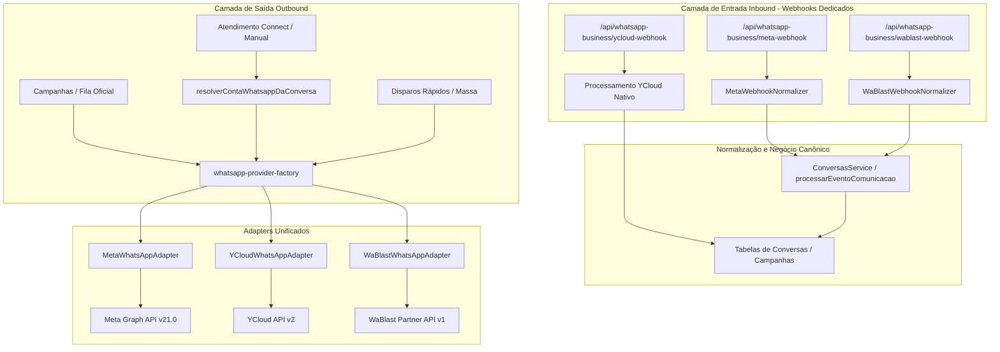
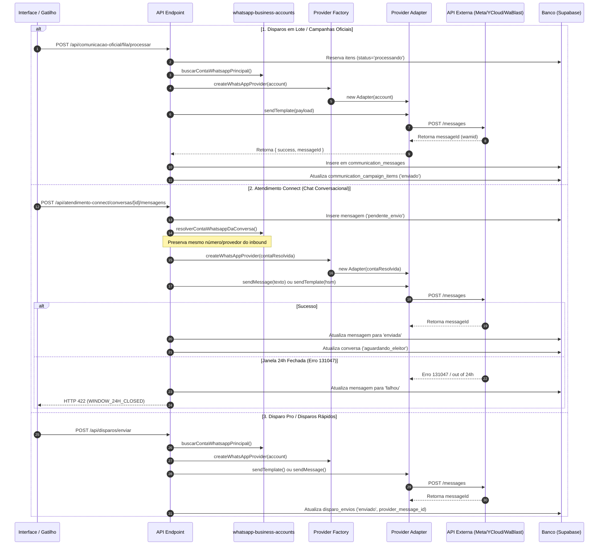
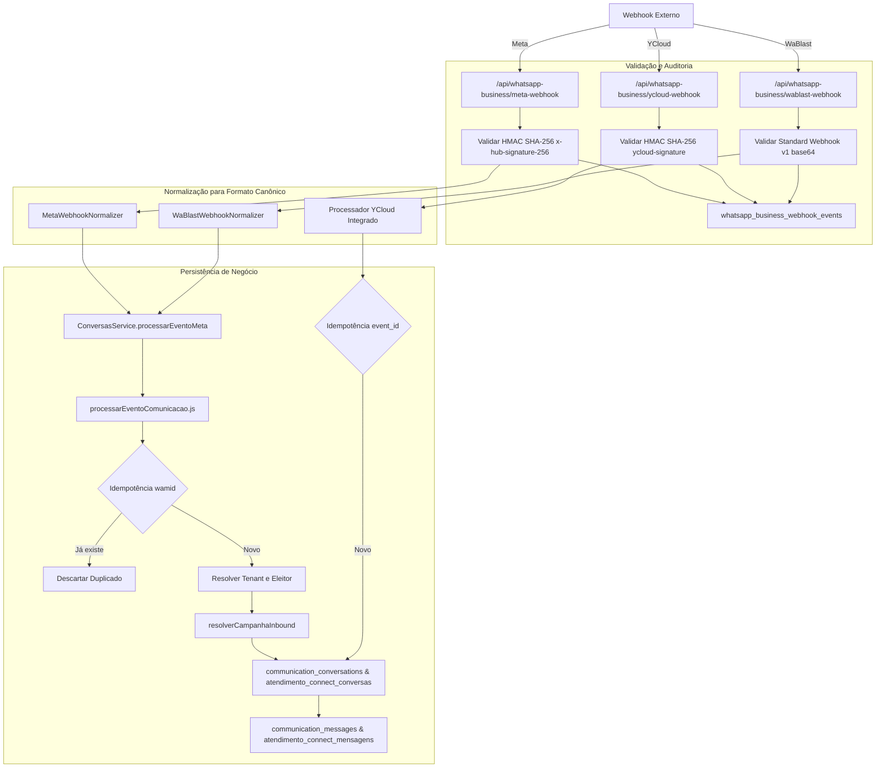

# AUDITORIA DO MÓDULO WHATSAPP — MANDATOPRO

> **CLASSIFICAÇÃO:** AUDITORIA TÉCNICA DE ENGENHARIA DE SOFTWARE  
> **STATUS DO AMBIENTE:** PRODUÇÃO ATIVA (FLUXOS REAIS DE DISPARO E RECEBIMENTO)  
> **DIRETRIZ:** NÃO HOUVE ALTERAÇÃO EM CÓDIGO, BANCO OU CONFIGURAÇÕES. MODO SOMENTE-LEITURA.  
> **DATA DO LAUDO:** 12/09/2026  

---

## 1. Arquitetura Atual

O módulo de WhatsApp do **MandatoPRO** é arquitetado sob uma estrutura híbrida multi-tenant, permitindo que cada gabinete parlamentar configure e utilize seu canal de comunicação oficial através de três provedores distintos: **META (Cloud API)**, **YCLOUD (WhatsApp API v2)** e **WABLAST (Partner API)**.

A arquitetura opera em três pilares principais:



### Características Centrais da Arquitetura:
1. **Multi-Tenant com Conta Ativa Única:** O gabinete possui uma ou mais contas cadastradas na tabela `whatsapp_business_accounts`, sendo exatamente **uma** marcada como `principal = true`.
2. **Endpoints de Webhook Isolados:** Cada provedor possui um endpoint HTTP POST exclusivo (`meta-webhook.js`, `ycloud-webhook.js`, `wablast-webhook.js`), garantindo que validações criptográficas de assinatura não interfiram entre si.
3. **Resolução Dinâmica de Contexto de Resposta:** No atendimento conversacional, o sistema identifica por qual número/provedor o eleitor enviou a última mensagem para responder pelo mesmo canal, evitando a perda da janela de 24 horas aberta.
4. **Isolamento de Credenciais:** As credenciais de cada provedor residem em colunas separadas e isoladas no banco de dados.

---

## 2. Provider Factory

### 2.1 Localização e Abstração
* **Arquivo:** `src/services/whatsapp-provider-factory.js`
* **Interface Base:** Classe abstrata `WhatsAppProviderContract` contendo:
  * `sendMessage(payload)`
  * `sendTemplate(payload)`
  * `getStatus()`

### 2.2 Provedores Suportados
* `META` (Adaptador: `MetaWhatsAppAdapter`)
* `YCLOUD` (Adaptador: `YCloudWhatsAppAdapter`)
* `WABLAST` (Adaptador: `WaBlastWhatsAppAdapter`)

### 2.3 Mecanismo de Seleção
A função `createWhatsAppProvider(account = {})` normaliza o campo `account.provider || account.provider_type || 'META'` para caixa alta:
* Se for `'WABLAST'` $\rightarrow$ instancia `WaBlastWhatsAppAdapter(account)`
* Se for `'YCLOUD'` $\rightarrow$ instancia `YCloudWhatsAppAdapter(account)`
* Qualquer outro valor (ou padrão) $\rightarrow$ instancia `MetaWhatsAppAdapter(account)`

### 2.4 Acoplamentos e Dependências Hardcoded Encontrados
Embora a factory use polimorfismo na saída, existem checagens literais com listas hardcoded em outros arquivos do sistema:
* `src/lib/whatsapp-business-accounts.js`: `if (!['META', 'YCLOUD', 'WABLAST'].includes(targetProvider))` na função `alterarProvedorWhatsappAtivo`.
* `src/pages/api/whatsapp-business/config.js`: `if (!['META', 'YCLOUD', 'WABLAST'].includes(targetProvider))`.
* `src/pages/api/whatsapp-business/templates.js`: estrutura `if (provider === 'WABLAST') ... else if (provider === 'YCLOUD') ... else if (provider === 'META')`.
* `src/services/whatsapp-business-sync.js`: blocos condicionais explícitos por provedor.
* `src/services/whatsapp-business-health.js`: blocos diagnósticos separados para cada provedor.

---

## 3. META

### 3.1 Identificação e Credenciais
* **Campos no Banco:** `access_token`, `waba_id`, `business_manager_id`, `verify_token`, `app_id`, `app_secret` na tabela `whatsapp_business_accounts`; `phone_number_id` na tabela `whatsapp_business_numbers`.
* **Fluxo de Conexão:** Suporta tanto o **Embedded Signup** oficial da Meta (via `src/pages/api/whatsapp-business/embedded-signup.js`) quanto cadastro manual de Token e Phone Number ID.

### 3.2 Cliente HTTP e Endpoints Externos
* **Serviço:** `WhatsAppBusinessService` (`src/services/whatsapp-business.js`) e `MetaGraphApiService` (`src/services/meta-graph-api.js`).
* **Base URL:** `https://graph.facebook.com/v21.0/{phone_number_id}`.
* **Autenticação:** Bearer Token no cabeçalho `Authorization: Bearer {access_token}`.
* **Disparo:** POST `/messages`.

### 3.3 Particularidades do Envio
* Requer estritamente o `phone_number_id` (identificador numérico interno da Graph API) como remetente na rota, e **não** o número em formato E.164.
* Exige identificador de mensagem `wamid.HBg...` no retorno HTTP 200.
* No envio de templates, se não houver variáveis dinâmicas (ex: template institucional estático), os parâmetros devem ser array vazio `[]`, sob pena de erro Meta `132000`.

---

## 4. YCLOUD

### 4.1 Identificação e Credenciais
* **Campos no Banco:** `ycloud_api_key`, `ycloud_webhook_endpoint_id`, `ycloud_webhook_secret` em `whatsapp_business_accounts`; `display_phone_number` e `bsuid` em `whatsapp_business_numbers`.
* **Fluxo de Conexão:** Configuração direta de credenciais via interface ou API de configuração.

### 4.2 Cliente HTTP e Endpoints Externos
* **Serviço:** `YCloudApiService` (`src/services/ycloud-api.js`).
* **Base URL:** `https://api.ycloud.com/v2`.
* **Autenticação:** Header customizado `X-API-Key: {apiKey}`.
* **Disparo:** POST `/whatsapp/messages`.
* **Consulta de Templates:** GET `/whatsapp/templates`.

### 4.3 Particularidades do Envio
* **Diferença Crítica de Remetente (`from`):** Na YCloud, o campo `from` no payload **obrigatoriamente deve ser o número de telefone em padrão E.164/dígitos limpos** (ex: `559180823372`), e **NUNCA** o `phone_number_id` da Meta. O adaptador `YCloudWhatsAppAdapter` faz essa resolução automática via método `_resolveFromNumber()`.
* **Templates:** O payload encapsula `{ type: 'template', template: { name, language: { code }, components } }`.

---

## 5. WABLAST

### 5.1 Identificação e Credenciais
* **Campos no Banco:** `wablast_account_id`, `wablast_external_ref` (`tenant_{id}`), `wablast_waba_id` em `whatsapp_business_accounts`.
* **Credenciais Globais de Servidor:** `WABLAST_API_KEY`, `WABLAST_BASE_URL` (`https://api.wablastmessage.com`), `WABLAST_WEBHOOK_SECRET` no arquivo de ambiente.
* **Fluxo de Conexão:** Onboarding Partner API via criação de sessão com redirect (`/api/whatsapp-business/wablast-onboarding`) e confirmação assíncrona pelo webhook `account.connected`.

### 5.2 Cliente HTTP e Endpoints Externos
* **Serviço:** `WaBlastApiService` (`src/services/wablast-api.js`).
* **Base URL:** `https://api.wablastmessage.com`.
* **Autenticação:** Header `Authorization: Bearer {WABLAST_API_KEY}`.
* **Disparo:** POST `/v1/messages`.

### 5.3 Particularidades do Envio
* O payload de disparo exige explicitamente o campo `account_id` associado ao tenant e o destinatário `to` no padrão `+55...` formatado com prefixo `+`.
* Os templates aprovados atualmente são gerenciados através de catálogo mapeado no sistema em `src/pages/api/whatsapp-business/templates.js`.

---

## 6. Fluxo de Envio

O MandatoPRO possui 4 caminhos de envio que convergem para a factory:

```
[MÓDULO ORIGEM] ──> [RESOLVER CONTA] ──> [PROVIDER FACTORY] ──> [ADAPTADOR] ──> [API EXTERNA]
```

### Diagrama Sequencial de Envio:



### Arquivos e seus Papéis no Envio:
1. `src/pages/api/comunicacao-oficial/fila/processar.js`: Motor em lote de campanhas oficiais, gerencia concorrência (chunks de 5), monta variáveis numéricas (`{{1}}`, `{{2}}`), cria conversas e atualiza contadores.
2. `src/pages/api/atendimento-connect/conversas/[id]/mensagens.js`: Envio manual do operador no chat; faz detecção de erro de janela fechada de 24h.
3. `src/pages/api/comunicacao-oficial/conversas/[id]/mensagens/enviar.js`: Endpoint auxiliar para envio manual dentro da interface de conversas da Comunicação Oficial.
4. `src/pages/api/disparos/enviar.js`: Gateway de envio individual e disparo em massa do módulo Disparo Pro com gravação em `disparo_envios`.
5. `src/pages/api/whatsapp-business/send.js`: Endpoint direto de teste operacional de envio.
6. `src/lib/whatsapp-business-accounts.js`: Fornece os métodos centrais `buscarContaWhatsappPrincipal` e `resolverContaWhatsappDaConversa`.

---

## 7. Fluxo de Recebimento

O fluxo de recebimento trata dois tipos fundamentais de eventos recebidos dos servidores do WhatsApp: **Mensagens Inbound** (eleitor enviando mensagem) e **Atualizações de Status** (`sent`, `delivered`, `read`, `failed`).

### Diagrama Geral de Recebimento:



### Mecanismos de Idempotência e Resolução:
* **Idempotência Meta e WaBlast:** Realizada via verificação por `provider_message_id` (o identificador `wamid`) nas tabelas `communication_messages` e `atendimento_connect_mensagens`.
* **Idempotência YCloud:** Realizada em primeiro nível pelo `event_id` na tabela `whatsapp_business_webhook_events`, descartando imediatamente requisições duplicadas enviadas pela YCloud.
* **Resolução de Eleitor:** A função busca pelo número normalizado (testando variações de DDD + 9 ou 8 dígitos) na tabela `eleitores`, associando a conversa ao eleitor cadastrado caso encontrado.
* **Atribuição de Campanha:** A função `resolverCampanhaInbound` aplica duas heurísticas sem suposição:
  1. *Nível 1 (Quote / Citação Direta):* O eleitor clicou em responder na mensagem enviada pela campanha (`quotedMessageId`).
  2. *Nível 2 (Janela Temporal Recente de 48h):* O eleitor recebeu apenas uma campanha recente com entrega confirmada nas últimas 48 horas.

---

## 8. Webhooks

Detalhamento técnico dos endpoints de webhook em funcionamento:

| Propriedade | Meta Cloud API | YCloud | WaBlast |
| :--- | :--- | :--- | :--- |
| **Endpoint** | `/api/whatsapp-business/meta-webhook` *(e proxy legado `/webhook`)* | `/api/whatsapp-business/ycloud-webhook` | `/api/whatsapp-business/wablast-webhook` |
| **Arquivo** | `meta-webhook.js` | `ycloud-webhook.js` | `wablast-webhook.js` |
| **Métodos HTTP** | GET (verificação challenge) e POST (eventos) | POST | POST |
| **Autenticação** | HMAC-SHA256 no header `x-hub-signature-256` calculado sobre o raw body via `app_secret` da conta ou global | HMAC-SHA256 no header `ycloud-signature` (`t=...,s=...`) contra raw body + timestamp e `ycloud_webhook_secret` | Standard Webhooks (`webhook-id`, `webhook-timestamp`, `webhook-signature` = `v1,...`) contra `whsec_...` |
| **Anti-Replay Attack** | N/A (Assinatura única por hash de payload) | Tolerância máxima de **300 segundos (5 min)** de drift no timestamp | Tolerância máxima de **300 segundos (5 min)** de drift no timestamp |
| **Identificação Tenant/Número** | Extrai `waba_id` de `entry[0].id` e `phone_number_id` de `changes[0].value.metadata` | Header `x-webhook-endpoint-id` mapeado na coluna `ycloud_webhook_endpoint_id` da conta | `external_ref` (`tenant_{id}`), fallback por `waba_id` ou conta WaBlast ativa |
| **Tratamento de Duplicatas** | Busca de wamid em `communication_messages` e `atendimento_connect_mensagens` | Consulta de `event_id` prévio em `whatsapp_business_webhook_events` | Idempotência por `provider_message_id` no normalizador |
| **Tratamento de Erros** | Responde 401 se assinatura falhar; 403 se `verify_token` incorreto; grava log em `whatsapp_business_webhook_events` | Responde 401 para assinatura inválida; 404 se endpoint não cadastrado; log auditado no banco | Responde 401 se assinatura inválida; 400 para payloads corrompidos; log auditado no banco |

---

## 9. Banco de Dados

### 9.1 Tabelas Auditadas
1. `tenants`: Entidade de isolamento de dados do gabinete.
2. `whatsapp_business_accounts`: Registro da conta e credenciais dos provedores.
3. `whatsapp_business_numbers`: Números de telefone vinculados à conta.
4. `whatsapp_business_webhook_events`: Tabela de auditoria de todos os webhooks recebidos.
5. `whatsapp_wablast_onboarding_sessions`: Sessões de onboarding da WaBlast.

### 9.2 Armazenamento do Provider e Restrições de Validação
* **Coluna:** `whatsapp_business_accounts.provider VARCHAR(30) NOT NULL DEFAULT 'META'`.
* **CHECK CONSTRAINT Atual:**
  ```sql
  CONSTRAINT whatsapp_business_accounts_provider_check
  CHECK (provider IN ('META', 'WABLAST', 'YCLOUD'))
  ```
  *(Definida formalmente na Migration 253).*

### 9.3 Credenciais Armazenadas por Provedor em `whatsapp_business_accounts`:
* **META:** `access_token`, `verify_token`, `app_id`, `app_secret`, `waba_id`, `business_manager_id`.
* **YCLOUD:** `ycloud_api_key`, `ycloud_webhook_endpoint_id`, `ycloud_webhook_secret`.
* **WABLAST:** `wablast_account_id`, `wablast_external_ref`, `wablast_waba_id`.
* **CAMPOS COMUNS:** `status` (`'ATIVO'`, `'INATIVO'`), `principal` (`BOOLEAN`), `production_ready` (`BOOLEAN`).

### 9.4 Estrutura de `whatsapp_business_numbers`:
* `account_id` (FK para `whatsapp_business_accounts.id` ON DELETE CASCADE)
* `tenant_id` (FK para `tenants.id` ON DELETE CASCADE)
* `phone_number_id` (VARCHAR(120), UNIQUE com tenant_id)
* `display_phone_number` (VARCHAR(40))
* `verified_name` (VARCHAR(255))
* `bsuid` (VARCHAR(255) — adicionado na Migration 252 para identificador de usuário comercial da YCloud)
* `principal` (BOOLEAN — índice único garantindo no máximo 1 número principal por conta)

### 9.5 Índices Relevantes:
* `idx_waba_principal_por_tenant`: `UNIQUE (tenant_id) WHERE principal = TRUE`
* `idx_waba_verify_token`: `UNIQUE (verify_token) WHERE verify_token IS NOT NULL`
* `idx_waba_provider_tenant`: `(tenant_id, provider, status)`
* `idx_waba_ycloud_endpoint`: `(ycloud_webhook_endpoint_id) WHERE ycloud_webhook_endpoint_id IS NOT NULL`
* `idx_waba_wablast_external_ref`: `(wablast_external_ref) WHERE wablast_external_ref IS NOT NULL`
* `idx_waba_wablast_account`: `(wablast_account_id) WHERE wablast_account_id IS NOT NULL`
* `idx_waba_webhook_events_event_id`: `(event_id) WHERE event_id IS NOT NULL`

### 9.6 Histórico de Migrations de Provedores:
* `238_create_tenant_whatsapp_business_accounts.sql`: Criou a estrutura base com foco exclusivo na Meta.
* `252_add_ycloud_provider_support.sql`: Adicionou a coluna `provider` (`CHECK IN ('META', 'YCLOUD')`), `ycloud_api_key`, `ycloud_webhook_endpoint_id`, `ycloud_webhook_secret` e `bsuid` em números.
* `253_add_event_id_to_webhook_events.sql`: Adicionou `event_id` em webhook events para idempotência.
* `253_add_wablast_provider_support.sql`: Removeu a constraint anterior e aplicou a nova `CHECK IN ('META', 'WABLAST', 'YCLOUD')`, adicionando colunas `wablast_account_id`, `wablast_external_ref` e `wablast_waba_id`.
* `254_create_wablast_onboarding_sessions.sql`: Criou tabela para gerenciar sessões de onboarding da Partner API.

---

## 10. Contrato dos Providers

A tabela abaixo compara todas as operações implementadas no ecossistema:

| Operação | META | YCLOUD | WABLAST | Arquivo/Implementação |
| :--- | :--- | :--- | :--- | :--- |
| **Envio de Texto** | Suportado (`sendTextMessage`) | Suportado (`sendMessage`) | Suportado (`sendMessage`) | `whatsapp-provider-factory.js` |
| **Envio de Template (HSM)** | Suportado (`sendTemplateMessage`) | Suportado (`sendMessage` com `type: 'template'`) | Suportado (`sendMessage` com `type: 'template'`) | `whatsapp-provider-factory.js` |
| **Header de Imagem em Template** | Suportado (`components[header].image.link`) | Suportado (`components[header].image.link`) | Suportado (`components[header].image.link`) | `fila/processar.js` |
| **Envio de Mídia Solta (Imagem/Áudio/Vídeo)** | Apenas leitura no webhook (envio direto não implementado no adapter) | Não exposto no adapter | Não exposto no adapter | Contrato atual só implementa `sendMessage` (texto) e `sendTemplate` |
| **Status da Conexão / Info Número** | Suportado via Graph API (`getPhoneInfo`) | Suportado via `/whatsapp/phoneNumbers` (`getStatus`) | Suportado via `/v1/accounts/{id}` (`getStatus`) | `whatsapp-provider-factory.js` |
| **Listagem de Templates Aprovados** | Dinâmico via Meta Graph API (`{waba}/message_templates`) | Dinâmico via YCloud API (`/whatsapp/templates`) | Estático / Catálogo oficial aprovado na WABA | `templates.js` |
| **Onboarding da Conta** | Embedded Signup Facebook SDK ou credencial manual | Cadastro manual de API Key e Webhook Endpoint | Sessão Partner API (`createOnboardingSession`) | `wablast-onboarding.js` |
| **Recepção de Webhook** | `/api/whatsapp-business/meta-webhook` | `/api/whatsapp-business/ycloud-webhook` | `/api/whatsapp-business/wablast-webhook` | Endpoints dedicados em `src/pages/api/whatsapp-business/` |
| **Normalizador de Eventos** | `MetaWebhookNormalizer` | Embutido diretamente no handler do webhook | `WaBlastWebhookNormalizer` | `src/services/*Normalizer.js` |
| **Detecção de Janela 24h Fechada** | Erro `131047` tratado explicitamente | Mensagem de erro de janela mapeada | Mensagem de erro de janela mapeada | `mensagens.js` |
| **Diagnóstico de Saúde (Health Check)** | Suportado com inspeção de Debug Token | Suportado com checagem de API Key e número | Suportado com checagem de Account ID e número | `whatsapp-business-health.js` |
| **Sincronização Periódica (Sync)** | Suportado via Graph API e histórico | Suportado via YCloud API e histórico | Suportado via status estático | `whatsapp-business-sync.js` |

---

## 11. Dependências entre Providers e Sistema

As dependências entre provedores e tabelas de negócio do MandatoPRO se distribuem em 4 módulos:

1. **Comunicação Oficial (Campanhas em Massa):**
   * Tabela `communication_campaign_items`: Armazena o `provider_message_id`.
   * Tabela `communication_messages`: Guarda a coluna `provider` (`'META'`, `'YCLOUD'`, `'WABLAST'`).
   * Tabela `communication_conversations`: Mantém o vínculo e preview da conversa do contato.
   * Tabela `communication_campaigns`: Contadores de mensagens enviadas, entregues, lidas e falhas são recalculados em tempo real pelos webhooks de status.

2. **Atendimento Connect (Chat Operacional / Central de Mensagens):**
   * Tabela `atendimento_connect_conversas`: Guarda em `metadata.origem` e `metadata.provider` qual provedor é responsável pelo diálogo.
   * Tabela `atendimento_connect_mensagens`: Guarda `provider_message_id`, `direcao` (`entrada`/`saida`/`nota`), status e `raw_payload`.

3. **Disparo Pro (Disparos Rápidos e Automação de Mandato):**
   * Tabela `disparo_envios`: Vincula o `provider_message_id` às mensagens de disparos rápidos e campanhas de aniversário/benefícios.

4. **Auditoria Geral de Webhooks:**
   * Tabela `whatsapp_business_webhook_events`: Registra **todos** os eventos recebidos (brutos e sanitizados), status da validação HMAC, timestamps e `event_id`.

---

## 12. Pontos de Risco

Classificação objetiva de criticidade para qualquer futura modificação:

### 🔴 ALTO RISCO (Impacto Imediato em Produção)
* **Alteração na CHECK CONSTRAINT `whatsapp_business_accounts_provider_check`:**  
  *Motivo:* O PostgreSQL valida todos os registros da tabela ao alterar constraints de linha. Se feita de forma síncrona sem `NOT VALID` ou com sintaxe incompatível, pode travar a tabela em produção ou rejeitar cadastros de contas existentes.
* **Modificação em `processarEventoComunicacao.js` ou `ConversasService.processarEventoMeta`:**  
  *Motivo:* É o núcleo canônico do recebimento de mensagens e atualização de status em tempo real. Qualquer erro de sintaxe ou exceção não tratada interrompe o processamento de mensagens de eleitores da Meta e da WaBlast simultaneamente.
* **Alterações nos Handlers de Webhook Existentes (`meta-webhook.js` e `ycloud-webhook.js`):**  
  *Motivo:* Fluxos de validação criptográfica (HMAC-SHA256) com leitura de raw body via stream. Qualquer alteração no middleware do Next.js ou na manipulação do body quebra a validação e faz os provedores externos desativarem os webhooks em produção.
* **Hierarquia e Precedência de Status (`STATUS_PRIORITY`):**  
  *Motivo:* As APIs externas frequentemente entregam webhooks fora de ordem (ex: evento `read` chega milissegundos antes do evento `delivered`). A lógica de precedência impede que uma mensagem já 'lida' seja rebaixada para 'enviada'. Mexer nessa matriz pode corromper as métricas de campanhas de todos os gabinetes.

### 🟡 MÉDIO RISCO (Impacto em Configurações ou Roteamento)
* **Adição de novo provider na Factory `whatsapp-provider-factory.js`:**  
  *Motivo:* O método `createWhatsAppProvider` é o ponto único de despacho de saída. O fallback padrão é `META`. Se o novo provider retornar erro ou incompatibilidade de assinatura de método (`sendMessage`/`sendTemplate`), quebra envios do tenant que o selecionar.
* **Resolução de Canal de Resposta (`resolverContaWhatsappDaConversa` em `whatsapp-business-accounts.js`):**  
  *Motivo:* Lógica refinada que garante que mensagens saiam pelo mesmo chip/número que o eleitor utilizou para falar com o gabinete.
* **Validação de Troca de Provedor Ativo (`alterarProvedorWhatsappAtivo` e `config.js`):**  
  *Motivo:* Contém validações estritas de completude (ex: checa se tem número vinculado e credenciais ativas antes de trocar a flag `principal = true`).

### 🟢 BAIXO RISCO (Extensão Isolada e Segura)
* **Criação de Arquivo de Cliente de API Isolado (ex: `novo-provider-api.js` em `src/services/`):**  
  *Motivo:* Arquivo totalmente novo e independente, sem qualquer importação ou impacto sobre o código existente.
* **Criação de Endpoint de Webhook Dedicado (ex: `/api/whatsapp-business/novo-provider-webhook.js`):**  
  *Motivo:* O Next.js trata cada arquivo na pasta `/pages/api/` como uma rota HTTP totalmente isolada. Adicionar uma nova rota não altera em nada o comportamento de `meta-webhook.js`, `ycloud-webhook.js` ou `wablast-webhook.js`.
* **Criação de Normalizador Dedicado (ex: `novoProviderWebhookNormalizer.js`):**  
  *Motivo:* Módulo desacoplado focado apenas em mapear o JSON específico do novo provedor para o formato canônico `{ tipo, provider_message_id, contact_id, status, conteudo }`.

---

## 13. Pontos Seguros de Extensão

Para que um novo provedor (como **WAFLY** ou qualquer outro) possa ser adicionado futuramente com **ZERO RISCO DE REGRESSÃO** aos fluxos existentes de META, YCLOUD e WABLAST, os pontos seguros e o checklist arquitetural identificado na auditoria são:

### 1. Extensão do Banco de Dados (Isolada)
* **Sem alterar colunas existentes:** Adicionar apenas as colunas específicas que o novo provedor necessitar na tabela `whatsapp_business_accounts` (ex: tokens, IDs de conta específicos).
* **Migration não-bloqueante para a CHECK CONSTRAINT:**  
  Utilizar o padrão seguro demonstrado na Migration 253:
  ```sql
  ALTER TABLE public.whatsapp_business_accounts DROP CONSTRAINT IF EXISTS whatsapp_business_accounts_provider_check;
  ALTER TABLE public.whatsapp_business_accounts ADD CONSTRAINT whatsapp_business_accounts_provider_check 
    CHECK (provider IN ('META', 'WABLAST', 'YCLOUD', 'NOVO_PROVIDER'));
  ```

### 2. Criação do Cliente HTTP Isolado (`src/services/novo-provider-api.js`)
* Criar uma classe cliente dedicada consumindo a API externa com sanitização de segredos em logs, espelhando a arquitetura de `ycloud-api.js` e `wablast-api.js`.

### 3. Implementação do Adaptador Unificado (`src/services/whatsapp-provider-factory.js`)
* Criar a classe `NovoProviderWhatsAppAdapter extends WhatsAppProviderContract` respeitando o contrato:
  * `sendMessage({ to, message, text })` $\rightarrow$ Retorna `{ success: true, messageId, id }`.
  * `sendTemplate({ to, templateName, components, idiomaCode })` $\rightarrow$ Retorna `{ success: true, messageId, id }`.
  * `getStatus()` $\rightarrow$ Retorna status da conexão.
* Adicionar a condição de fábrica em `createWhatsAppProvider`:
  ```javascript
  if (provider === 'NOVO_PROVIDER') {
    return new NovoProviderWhatsAppAdapter(account);
  }
  ```
  *Mantendo o fallback para META intacto ao final.*

### 4. Criação de Webhook Endpoint Dedicado
* Criar rota isolada em `src/pages/api/whatsapp-business/novo-provider-webhook.js`.
* Criar seu respectivo `novoProviderWebhookNormalizer.js`.
* Reutilizar o método canônico `ConversasService.processarEventoMeta(eventoNormalizado)`, que já é agnóstico a provedor e trata idempotência, vinculação de eleitores e sincronização de conversas sem duplicar código.

### 5. Registro nas Funções de Negócio de Apoio
* Incluir `'NOVO_PROVIDER'` na lista permitida em:
  * `alterarProvedorWhatsappAtivo` em `whatsapp-business-accounts.js`.
  * Endpoint `config.js`.
  * Método de resolução de conversa `resolverContaWhatsappDaConversa`.
  * Health check `whatsapp-business-health.js`.

---

## 14. Conclusão

A arquitetura do módulo de WhatsApp do MandatoPRO é **modular, robusta e orientada a adaptadores**, tendo evoluído com sucesso através de migrações anteriores para acomodar YCloud e WaBlast ao lado da Meta Cloud API original.

O sistema demonstra maturidade operacional em produção:
* A camada de **saída (Outbound)** já é 100% orientada à abstração `WhatsAppProviderContract`.
* A camada de **entrada (Inbound)** adota a estratégia segura de **webhooks dedicados por provedor**, o que isola totalmente falhas de autenticação criptográfica e evita qualquer contaminação entre provedores.
* Os acoplamentos existentes limitam-se a listas de checagem literal (`IN ('META', 'WABLAST', 'YCLOUD')`), concentradas em pontos previsíveis de validação administrativa e diagnósticos.

Dessa forma, o sistema está **arquiteturalmente pronto e seguro** para a futura incorporação de um novo provedor, contanto que o padrão de adapter isolado, endpoint de webhook próprio e migration não-bloqueante seja rigorosamente seguido, assegurando estabilidade contínua aos fluxos de produção ativos da Meta, YCloud e WaBlast.
